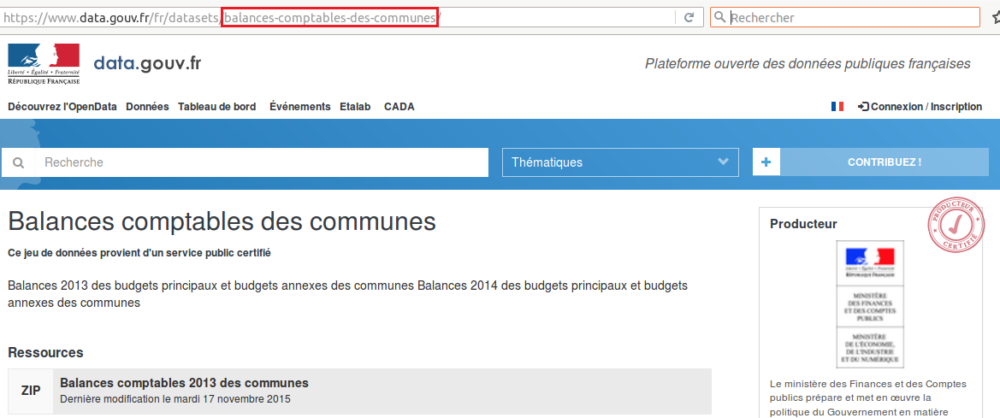
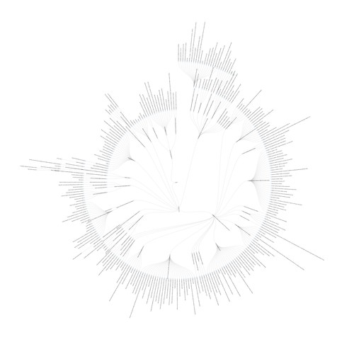

Cartographie Collaborative des Données de l'État
========================================================

```{r echo=FALSE}
library(httr)
library(ggplot2)
library(jsonlite)

api_adress <- "http://bases.gouv2.fr"
bases <- content(GET(paste(api_adress,"/bases",sep="")))
administrations <- content(GET(paste(api_adress,"/administrations",sep="")))
gestionnaires <- content(GET(paste(api_adress,"/gestionnaires",sep="")))
basesliste <- content(GET(paste(api_adress,"/bases/liste",sep="")))
producteurs <- content(GET(paste(api_adress,"/datasets/producteurs",sep="")))
datasets <- content(GET(paste(api_adress,"/datasets",sep="")))
basesdatasets <- content(GET(paste(api_adress,"/bases/datasets",sep="")))
intersectproducteursadministrations <- intersect(producteurs, administrations)
acronymes <- content(GET(paste(api_adress,"/bases/acronymes",sep="")))

diff <- setdiff(gestionnaires, administrations)

textes <- list()
for (base in basesliste){
  if (!is.null(base$textes)){
    for(texte in attributes(base$textes)){
      textes <- c(texte,textes)
    }
  }
}
textes <- data.frame(matrix(unlist(textes), byrow=T))
textes$type <- as.character(lapply(strsplit(as.character(textes$matrix.unlist.textes...byrow...T.), " "), "[", 1))
textestypes <- as.data.frame(table(textes$type))
  
ban <- list()
for (base in basesliste){
if (base$nom == "Base Adresse Nationale"){
  ban <- base
  }
}
```

La Cartographie Collaborative des Données de l'État est le répertoire de métadonnées de l'État Français. Elle décrit les données gérées par les administrations Françaises, leur organisation et leur gouvernance.

## Objectifs et usages

La Cartographie Collaborative des Données de l'État a pour objectif:

* D'identifier les référentiels nationaux.
* De modéliser la gouvernance des données
* De rationaliser l'accès au données, leur disponibilité et leur sécurité pour simplifier leur circulation.
* D'évaluer la qualité globale des données gérées par l'État.
* De faciliter les politiques fondées sur les données.

## Composition de la cartographie

La Cartographie Collaborative des Données de l'État est une base de données en 3 parties:
  
  1. Un annuaire des gestionnaires de données de l'État, issu de l'annuaire de l'administration mis à jour par la DILA.
  2. Une liste à vocation exhaustive de toutes les bases de données de l'État, et de leurs gestionnaire identifié.
  3. Pour chaque base, une représentation complète et à jour de sa structure de données.
  
La cartographie a pour objectif de distribuer des informations structurées, claires et pertinentes sur toutes les données de l'État, qu'elles soient ouvertes ou non. Seuls l'annuaire et la liste des bases sont pour le moment publiés en Open Data sur la plateforme [Data.Gouv.fr](https://www.data.gouv.fr/fr/datasets/cartographie-collaborative-des-donnees-de-letat/).

## Périmètre de la cartographie

### Gestionnaires

Sont concernés par la cartographie des données toutes les entités répertoriées par l'annuaire de l'administration, mis à jour par la [Direction Légale de l'Information Légale et Administrative](http://www.dila.premier-ministre.gouv.fr/) (DILA). Les administrations territoriales, les [Groupements d'Intérêt Public](http://www.economie.gouv.fr/daj/gip), les établissements publics administratifs (EPA) et les établissements publics industriel et commercial (EPIC) sont également dans le périmètre de la cartographie.

### Bases de données

Une base de données est un ensemble de données stockées au même endroit et structurées selon un schéma commun. Elle répond généralement à une ou un ensemble de problématiques et permet à différents acteurs d'accéder ou de mettre à jour les données.

* La cartographie ne répertorie pas pour le moment les données déstructurées. 
* Un fichier plat tel qu'un fichier Excel peut être considéré comme une base de données dès lors qu'un processus d'accès et de mise à jour aux données a été clairement défini. Un fichier Excel ne constitue cependant pas un référentiel tel que défini par le [Cadre Commun d’Architecture des Référentiels de données](https://references.modernisation.gouv.fr/sites/default/files/Cadre%20Commun%20d'Architecture%20des%20R%C3%A9f%C3%A9rentiel%20de%20donn%C3%A9es%20v1.0_0.pdf)

## Annuaire de gestionnaires de données

Les gestionnaires de données de l'État sont les entités répertoriées par l'annuaire de l'administration mis à jour par la [DILA](http://www.dila.premier-ministre.gouv.fr/). Cet annuaire est consultable via une [interface web en ligne](https://lannuaire.service-public.fr) ou sous la forme d'un [jeu de données ouvert publié sur Data.gouv.fr](https://www.data.gouv.fr/fr/datasets/annuaire-des-services-publics-nationaux/). La dernière version de l'annuaire intégrée à la cartographie contient [`r length(administrations)` administrations](http://bases.gouv2.fr/administrations).

Chaque entité de l'annuaire est rattachée à son administration parente, l'ensemble des administrations pouvant être représenté comme un graphe non orienté acyclique et connexe dont voici une représentation graphique:

[](reporting/administrations.png)

Restent à intégrer:

* Les administrations territoriales de l'annuaire des services publics.
* Les [Groupements d'Intérêt Public](http://www.economie.gouv.fr/daj/gip), dont la liste est [publiée sur Legifrance](https://www.legifrance.gouv.fr/affichSarde.do?reprise=true&page=1&idSarde=SARDOBJT000007105856&ordre=null&nature=null&g=ls).
* Les Établissements publics: [EPA et EPIC](http://www.vie-publique.fr/decouverte-institutions/institutions/administration/organisation/structures-administratives/que-sont-etablissements-publics-administratif-epa-industriel-commercial-epic.html)

L'historisation de ces annuaires est prévue.

## Liste des bases de données

La cartographie décrit [`r length(bases)` bases de données](http://bases.gouv2.fr/bases) pour [`r length(gestionnaires)` gestionnaires](http://bases.gouv2.fr/gestionnaires). Parmis ceux-ci, [`r length(diff)` gestionnaires](http://bases.gouv2.fr/gestionnaires/inconnus) ne sont pas encore identifiés dans l'annuaire des administrations.

### Sources

La liste des bases de données et leurs propriétés est mise à jour de manière collaborative ainsi que par des flux d'alimentation automatiques. Des [scripts](scripts/) ont été développés pour intégrer différentes sources telles que les cartographies thématiques publiées en Open Data.

* [La cartographie des bases de données publiques en santé.](scripts/sante)
* [La cartographie des données publiques du logement](scripts/logement)

Pour l'enrichissement ponctuel de la cartographie, la modification du fichier [bases.json](data/bases.json) suivi d'une [pull request](https://help.github.com/articles/using-pull-requests/) sur le [répertoire Git de la cartographie](https://github.com/SGMAP-AGD/cartodonnees) est pour le moment nécéssaire. Ce fichier est [régulièrement intégré](scripts/import/import.R) au référentiel de la cartographie.

En raison de la diversité des sources, des données et informations incomplètes, incorrectes ou impertinentes sont susceptibles d'exister.

### Modèle de données 

Un modèle de données semi-structuré permet de décrire chaque base de données. Ce modèle évolue au fur et à mesure des mises à jour et de l'enrichissement de la cartographie. de nouveaux champs sont donc suceptibles d'apparaitre au cours du temps. Seuls les champs `nom` et `gestionnaire` sont indispensables pour décrire l'existence d'une base de données au sein de cette cartographie.

La liste des champs de la liste des bases de données est volontairement limitée, tandis que 

Sont décrits ci-dessous tous les champs actuellement susceptibles d'être renseignés pour une base de données de la cartographie.

#### Nom

Le nom complet de la base de données, tel qu'il apparaît dans les textes officiels. Ce champ est obligatoire et renseigné pour toutes les bases de données référencées dans la cartographie.

#### Gestionnaire

Le nom du gestionnaire de la base de données, tel qu'il apparaît dans l'[annuaire des services publics](https://lannuaire.service-public.fr). Comme le nom complet de la base de données, ce champ est obligatoire. Les champs `gestionnaire` et `nom` forment à eux deux la [clé composite](https://en.wikipedia.org/wiki/Compound_key) permettant d'identifier chaque base de données de la cartographie.

De nombreuses bases de données sont co-gérées par plusieurs administrations. Dans ce cas, le champ `gestionnaire` devient une liste contenant les tous les co-gestionnaires.

#### Acronyme

L'acronyme de la base de données, ou nom informel de la base, lorsqu'il existe. Ce champ n'est pas obligatoire. Il est actuellement renseigné pour `r length(acronymes) ` bases de données, soit `r round(length(acronymes)* 100/length(bases),2)`% des bases de la cartographie.

#### Description

La description est un champ texte libre décrivant la base de données. Sa taille n'est pas limitée et cette description vise à être la plus complète et exhaustive possible.

#### Textes

Le champ `textes` est une liste des textes officiels publiés par des administrations faisant référence à la base de données. Différents types de textes sont référencés dans la cartographie. En voici la distribution:

```{r echo=FALSE}
c <- ggplot(textestypes)
c <- c + geom_bar(mapping = aes(x = reorder(Var1, Freq),y = Freq), stat = "identity",width=.6)
c <- c + coord_flip()
c <- c + xlab("")
c <- c + ylab("")
c <- c + theme(axis.text.y = element_text(size=13,face="bold"), panel.background = element_blank())
c <- c + theme(axis.text.x = element_text(size=13,face="bold"), plot.title = element_text(size=12, face="bold"))
c <- c + ggtitle("Types de textes présents dans la cartographie collaborative")
c
```

#### Alimentation

Les flux entre bases de données sont renseignés dans le champ `alimentation`. Il comporte la liste des organismes alimentant la base de données, ou directement les bases d'origine des données. Le flux de données n'est pas décrit à ce niveau, simplement référencé.

#### URL

Le champ `url` ou [Uniform Resource Locator](https://fr.wikipedia.org/wiki/Uniform_Resource_Locator) contient une adresse web vers le portail officiel de la base de données, si il existe. Il s'agit de sites web permettant de consulter le contenu des bases par le biais d'un moteur de recherche lorsque celles ci sont ouvertes.

#### Références

Les adresses web évoquant les bases de données de la cartographie sont listées dans le champ `références`. Contrairement au champ `url`, il ne s'agit pas du portail offciel de la base.

#### Commentaire

Le champ `commentaire` est un champ libre, tout comme le champ `description`. Il regroupe toutes les informations n'ayant pas leur palce dans la description de la base de données.

#### Datasets

Le portail Open Data de l'État [data.gouv.fr](https://www.data.gouv.fr) recense les datasets, ou jeux de données ouverts de l'administration. Les gestionnaires, ici de datasets et pas de bases de données, y sont appelés "producteurs". La cartographie collaborative des données permet de retracer la base d'origine des datasets sur le portail, lorsque le champ `datasets` de la cartographie est renseigné pour une base de données, et que la ou les informations que le champ contient sont conformes.

Le champ `datasets` contient les "slugs" des jeux de données de [data.gouv.fr](https://www.data.gouv.fr). Il s'agit de la dernière partie de l'url du jeu, pouvant être trouvée en haut du navigateur. Le "slug" est encadré en rouge sur cet aperçu du portail [data.gouv.fr](https://www.data.gouv.fr):

[](figure/datagouvslug.png)

`r length(producteurs)` producteurs de données publient actuellement `r length(datasets)` datasets sur [data.gouv.fr](https://www.data.gouv.fr). `r length(intersectproducteursadministrations)` producteurs du portail sont présents dans l'annuaire des administrations, soit `r round(length(intersectproducteursadministrations) * 100/ length(producteurs),2)`%.

`r length(basesdatasets)` datasets sont renseignés dans la cartographie. Il est donc possible de retracer la base de données d'origine de `r round(length(basesdatasets) * 100/ length(datasets),2)`% des jeux de données publiés sur [data.gouv.fr](https://www.data.gouv.fr).

#### Wikidata

[Wikidata](https://www.wikidata.org/wiki/Wikidata:Main_Page) est un projet de base de données libre éditée de manière collaborative et hébergée par la [Wikimedia Foundation](https://wikimediafoundation.org/wiki/Home). Il s'agit tout comme la partie *Bases de données* de la cartographie d'une base collaborative structurée, toutefois à visée plus exhaustive que la cartographie.

Les identifiants des bases décrites dans [Wikidata](https://www.wikidata.org/wiki/Wikidata:Main_Page) sont renseignées dans le champ `wikidata` pour permettre une interopérabilité entre les 2 projets.

#### Exemple: La Base Adresse Nationale

Les données de la cartographie sont stockées sous forme de [JSON](http://www.json.org/json-fr.html). Voici comment la Base Adresse Nationale est décrite: 

```
"Base Adresse Nationale": {
    "description": "Pour que les services d’urgence arrivent au bon endroit, pour vous permettre de réaliser une analyse cartographique en quelques clics ou encore pour que les opérateurs publics et privés coordonnent mieux leurs chantiers, ce référentiel, véritable enjeu de souveraineté pour la France, est la première alliance entre l’État et la société civile. La Base Adresse Nationale est une base de données qui a pour but de référencer l’intégralité des adresses du territoire français. Elle est constituée par la collaboration entre: des acteurs nationaux tels que l’IGN et La Poste, des acteurs locaux tels que les collectivités, les communes, les SDIS, des citoyens par exemple à travers le projet OpenStreetMap et l’association OpenStreetMap France. Le projet est co-gouverné par l’Administrateur Général des Données et le Conseil National de l’Information Géographique.",
    "textes": {
      "Convention BAN": "http://openstreetmap.fr/f/Convention%20BAN%2015%20avril%202015%20SCAN%20SIGNE.pdf"
    },
    "gestionnaire": [
      "Mission Étalab",
      "Institut national de l'information géographique et forestière",
      "Groupe La Poste"
    ],
    "liens": "https://adresse.data.gouv.fr/",
    "alimentation": [
      "Code Géographique Officiel",
      "Groupe La Poste",
      "Direction générale des finances publiques"
    ],
    "datasets": "ban-base-adresse-nationale",
    "acronyme": "BAN"
  }
```

### Représenter la cartographie

Considérées comme entitées dépendantes des leur gestionnaires, les bases de données peuvent être intégrées à l'arbre des administrations. La visualisation est alors similaire à celle de l'annuaire:

[](reporting/cartographie.png)

### Requêter la cartographie

La [cartographie](data/bases.json) peut être parcourue manuellement à l'aide de n'importe quel éditeur de texte.

Il est également possible d'utiliser [JQ](tutos/jq.md) pour requêter la cartograhpie.

## Répertoire des structures de données

La documentation des structures de données des bases référencées est la prochaine étape de la cartographie. Des expérimentations sont à venir, notamment sur quelques bases ouvertes tel que la [Base Adresse Nationale](https://adresse.data.gouv.fr/) et la présente cartographie.

## Structure technique de la cartographie

La cartographie collaborative est une base de données, à l'image des entitées qu'elle référence. À ce titre, elle est présente dans son propre référentiel, modélisée en suivant le même schéma que toutes les autres bases.
Bien que la cartographie des bases de données soit pour l'instant le seul dataset produit, la cartographie intègre d'autres sources.

* [L'annuaire des services publics](https://www.data.gouv.fr/fr/datasets/annuaire-des-services-publics-nationaux/) publié par la [DILA](http://www.dila.premier-ministre.gouv.fr/).
* [La liste de des jeux de données publiés sur le portail Data.gouv.fr](https://www.data.gouv.fr/fr/datasets.csv)

La cartographie dispose de copies de ces données le plus à jour possible, dont les versions font uniquement référence dans le cadre local de la cartographie. Ces versions ne sont pas publiées et les originaux doivent être la source de toute autre réutilisation.

## Portail collaboratif

Le déploiement d'un portail collaboratif est prévu pour permettre à chacun de contribuer à la parte *Bases de données* de la cartographie sans avoir à utiliser [Git](https://git-scm.com/).

### Bibliographie

* [Les apports de la méthode MDM dans la performance du SI des entreprises.](http://axelkamalak.eu/doc/mdm.pdf)
* [Data Management : qualité des données et compétitivité](http://www.lavoisier.fr/livre/informatique/data-management-qualite-des-donnees-et-competitivite/brasseur/descriptif-9782746212107)
* [MDM : Enjeux et méthodes de la gestion des données](http://www.eyrolles.com/Informatique/Livre/mdm-enjeux-et-methodes-de-la-gestion-des-donnees-9782100519101)
* [Defining Master Data](http://www.b-eye-network.com/view/2918)
* [Enjeux business des données](http://www.cigref.fr/wp/wp-content/uploads/2014/10/CIGREF-Enjeux-business-donnees-2014.pdf)
* [We need open and vendor-neutral metadata services](https://www.oreilly.com/ideas/we-need-open-and-vendor-neutral-metadata-services)
* [Big data at a crossroads: Time to go meta (on use)](http://conferences.oreilly.com/strata/big-data-conference-ny-2015/public/schedule/detail/43506)
* [Michel Volle, De l'Informatique, savoir vivre avec l'automate](http://www.volle.com/ouvrages/informatique/informatique1.pdf)
* [Mapping Big Data, A Data-Driven Market Report](http://www.oreilly.com/data/free/mapping-big-data.csp)
* [Enjeux du Master Data Management](http://alfi.fr/files/pdf/livre_blanc_mdm_master_data_management.pdf)
* [Process-Driven Master Data Management for Dummies](http://www.pcworld.idg.com.au/whitepaper/370724/process-driven-master-data-management-for-dummies/download/?type=other&arg=0&location=featured_list.)
