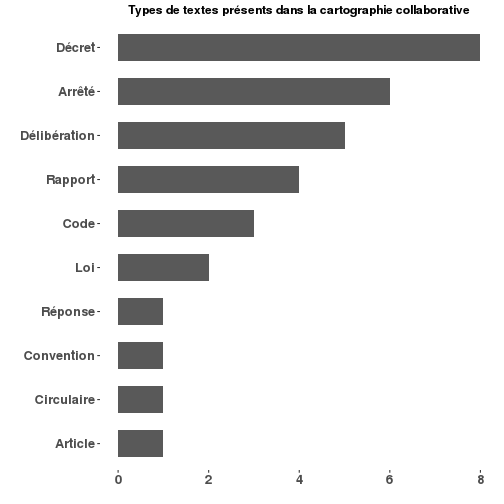

Cartographie Collaborative des Données de l'État
========================================================


La Cartographie Collaborative des Données de l'État est le référentiel de métadonnées de l'État Français. Elle décrit les données produites et gérées par les administrations Françaises, leurs organisation et leur gouvernance.

## Objectifs et usages

La Cartographie Collaborative des Données de l'État a pour objectif de:

* Identifier les référentiels nationaux et les valoriser.
* Rationaliser la gouvernance des données et faciliter leur circulation entre administrations.
* Améliorer la qualité des données.
* Généraliser la mise en place de politiques fondées sur les données.

## Composition

La Cartographie Collaborative des Données de l'État est propose 3 niveaux de lecture:
  
  1. Un annuaire des gestionnaires de données de l'État, issu de l'annuaire de l'administration mis à jour par la DILA.
  2. Une liste à vocation exhaustive de toutes les bases de données de l'État, chacune reliée à son administration gestionnaire.
  3. Pour chaque base, une représentation complète et à jour de sa structure de données.
  
La cartographie a pour objectif est de distribuer des informations structurées, claires et pertinentes sur toutes les données de l'État, qu'elles soient ouvertes ou non. Seuls le niveau 2 est aujourd'hui publiés en Open Data sur la plateforme [Data.Gouv.fr](https://www.data.gouv.fr/fr/datasets/cartographie-collaborative-des-donnees-de-letat/).

## Gestionnaires de données

Les gestionnaires de données de l'État sont les entités répertoriées par l'annuaire de l'administration mis à jour par la [Direction Légale de l'Information Légale et Administrative](http://www.dila.premier-ministre.gouv.fr/) (DILA). Cet annuaire est consultable via une [interface web en ligne](https://lannuaire.service-public.fr) ou sous la forme d'un [jeu de données ouvert publié sur Data.gouv.fr](https://www.data.gouv.fr/fr/datasets/annuaire-des-services-publics-nationaux/). La dernière version de l'annuaire intégrée à la cartographie contient [3799 administrations](http://bases.gouv2.fr/administrations).

Chaque entité de l'annuaire est rattachée à son administration parente, l'ensemble des administrations pouvant être représenté comme un graphe non orienté acyclique et connexe, ou arbre dont voici une représentation graphique:

[](reporting/administrations.png)

Restent à intégrer:

* Les administrations territoriales de l'annuaire des services publics.
* Les [Groupements d'Intérêt Public](http://www.economie.gouv.fr/daj/gip), dont la liste est [publiée sur Legifrance](https://www.legifrance.gouv.fr/affichSarde.do?reprise=true&page=1&idSarde=SARDOBJT000007105856&ordre=null&nature=null&g=ls).
* Les Établissements publics: [EPA et EPIC](http://www.vie-publique.fr/decouverte-institutions/institutions/administration/organisation/structures-administratives/que-sont-etablissements-publics-administratif-epa-industriel-commercial-epic.html)

L'historisation de ces annuaires est prévue.

## Bases de données

La cartographie décrit [405 bases de données](http://bases.gouv2.fr/bases) pour [95 gestionnaires](http://bases.gouv2.fr/gestionnaires). Parmis ceux-ci, [41 gestionnaires](http://bases.gouv2.fr/gestionnaires/inconnus) ne sont pas encore identifiés dans l'annuaire des administrations.

### Sources

La liste des bases de données et leurs attributs est mise à jour automatiquement ainsi que de manière collaborative. Des [flux](scripts/) ont été développés pour intégrer différentes sources telles que les cartographies thématiques publiées en Open Data.

* [La cartographie des bases de données publiques en santé.](scripts/sante)
* [La cartographie des données publiques du logement](scripts/logement)

Pour l'enrichissement ponctuel de la cartographie, la modification du fichier [bases.json](data/bases.json) suivi d'une [pull request](https://help.github.com/articles/using-pull-requests/) sur le [répertoire Git de la cartographie](https://github.com/SGMAP-AGD/cartodonnees) est pour le moment nécéssaire. Ce fichier est [régulièrement intégré](scripts/import/import.R) au référentiel de la cartographie.

En raison de la diversité des sources, des données et informations incomplètes, incorrectes ou impertinentes sont suceptibles d'exister .

### Modèle de données 

Un modèle de données semi-structuré permet de décrire chaque base de données. Ce modèle évolue au fur et à mesure des mises à jour et de l'enrichissement de la cartographie. de nouveaux champs sont donc suceptibles d'apparaitre au cours du temps. Seuls les champs `nom` et `gestionnaire` sont indispensable pour décrire l'existence d'une base de données au sein de cette cartographie. Sont décrits ci-dessous tous les champs actuellement suceptibles d'être renseignés pour une base de données de la cartographie. 

#### Nom

Le nom complet de la base de données, tel qu'il apparaît dans les textes officiels.

#### Acronyme

L'acronyme de la base de données, ou nom officieux contrairement au nom complet.

#### Gestionnaire

Le nom du gestionnaire de la base de données, tel qu'il apparaît dans l'[annuaire des services publics](https://lannuaire.service-public.fr).
De nombreuses bases de données sont co-gérées par plusieurs administrations. Dans ce cas, le champ `gestionnaire` devient une liste contenant les tous les co-gestionnaires.

#### Description

La description est un champ texte libre décrivant la base de données. Sa taille n'est pas limitée et cette description vise à être la plus complète possible.

#### Textes

Le champ `textes` est une liste des textes officiels faisant référence à la base de données. Y est 

 


#### Alimentation

Les flux entre bases de données sont renseignés dans le champ `alimentation`. Il comporte la liste des organismes alimentant la base de données, ou directement les bases d'origine des données. Le flux de données pas décrit à ce niveau, simplement référencé.

#### Références

#### Datasets

#### Wikidata

#### Commentaire

#### Exemple: La BAN

Les données de la cartographie sont stockées sous forme de [JSON](http://www.json.org/json-fr.html). Voici comment la Base Adresse Nationale est décrite: 


```
## {
##   "nom": ["Base Adresse Nationale"],
##   "description": ["Pour que les services d’urgence arrivent au bon endroit, pour vous permettre de réaliser une analyse cartographique en quelques clics ou encore pour que les opérateurs publics et privés coordonnent mieux leurs chantiers, ce référentiel, véritable enjeu de souveraineté pour la France, est la première alliance entre l’État et la société civile. La Base Adresse Nationale est une base de données qui a pour but de référencer l’intégralité des adresses du territoire français. Elle est constituée par la collaboration entre: des acteurs nationaux tels que l’IGN et La Poste, des acteurs locaux tels que les collectivités, les communes, les SDIS, des citoyens par exemple à travers le projet OpenStreetMap et l’association OpenStreetMap France. Le projet est co-gouverné par l’Administrateur Général des Données et le Conseil National de l’Information Géographique."],
##   "textes": {
##     "Convention BAN": ["http://openstreetmap.fr/f/Convention%20BAN%2015%20avril%202015%20SCAN%20SIGNE.pdf"]
##   },
##   "gestionnaire": [
##     ["Mission Étalab"],
##     ["Institut national de l'information géographique et forestière"],
##     ["Groupe La Poste"]
##   ],
##   "liens": ["https://adresse.data.gouv.fr/"],
##   "alimentation": [
##     ["Mission Étalab"],
##     ["Code Géographique Officiel"],
##     ["Groupe La Poste"],
##     ["Direction générale des finances publiques"]
##   ],
##   "datasets": ["ban-base-adresse-nationale"],
##   "acronyme": ["BAN"]
## }
```

### Représenter la cartographie

Considérées comme entitées dépendantes des leur gestionnaires, les bases de données peuvent être intégrées à l'arbre des administrations. La visualisation est alors similaire à celle de l'annuaire:

[](reporting/cartographie.png)

### Intégration [data.gouv.fr](https://www.data.gouv.fr)

Le portail Open Data de l'État [data.gouv.fr](https://www.data.gouv.fr) recense les datasets, ou jeux de données ouverts de l'administration. Les gestionnaires y sont appelés producteurs. La cartographie collaborative des données permet de retracer la base d'origine des datasets sur le portail, lorsque le champ `datasets` de la cartographie est renseigné pour une base de données, et que la ou les chaînes de caractère qu'il contient sont conformes.

401 producteurs de données publient actuellement 21785 datasets sur [data.gouv.fr](https://www.data.gouv.fr). 40 producteurs sont présents dans l'annuaire des administrations, soit 9.98%.

## Structures des données

La documentation des structures de données des bases référencées ne sont pas encore à l'ordre du jour. Des expérimentations sont à venir, notamment sur quelques bases ouvertes tel que la [Base Adresse Nationale](https://adresse.data.gouv.fr/) et la présente cartographie.

## Structure technique de la cartographie

La cartographie collaborative est une base de données, à l'image des entitées qu'elle référence. À ce titre, elle est présente dans son propre référentiel, modélisée en suivant le même schéma que toutes les autres bases.
Bien que la cartographie des bases de données soit pour l'instant le seul dataset produit, la cartographie intègre d'autres sources.

* [L'annuaire des services publics](https://www.data.gouv.fr/fr/datasets/annuaire-des-services-publics-nationaux/) publié par la [DILA](http://www.dila.premier-ministre.gouv.fr/).
* [La liste de des jeux de données publiés sur le portail Data.gouv.fr](https://www.data.gouv.fr/fr/datasets.csv)

La cartographie dispose de copies de ces données le plus à jour possible, dont les versions font uniquement référence dans le cadre local de la cartographie. Ces versions ne sont pas publiées et les originaux doivent être la source de toute réutilisation.

## Portail collaboratif


## Feuille de route

* Schéma des métadonnées Niveau 2
  - Stabilisation du schéma.

* Gestionnaires de données
  - Historisation des administrations françaises.
  - Intégration des gestionnaires manquants.
  
* Data.gouv.fr
  - Harmonisation des gestionnaires/producteurs.
  - Intégration de la cartographie au portail data.gouv.fr.

* Portail Collaboratif
  - Définition d'un solution.
  - Déploiement de la solution retenue.
